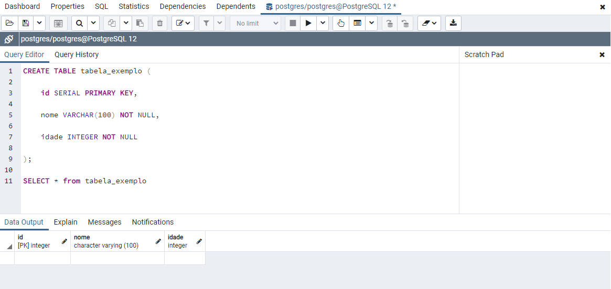
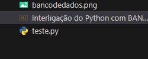
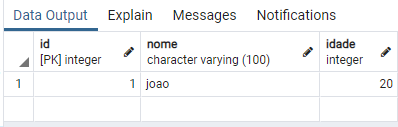

# Interligação do Python com BANCO DE DADOS

- Criar a tabela no **PGADMING**

- Criar a pasta(opcional) e o arquivo(obrigatório) do python como "teste.py"

- Execute o arquivo (verifique se o módulo **psycopg2** está instalado, caso não use pip install)
    - Adicione algumas informações na tela
- Veja no **PGADMING** os dados inseridos na tabela

